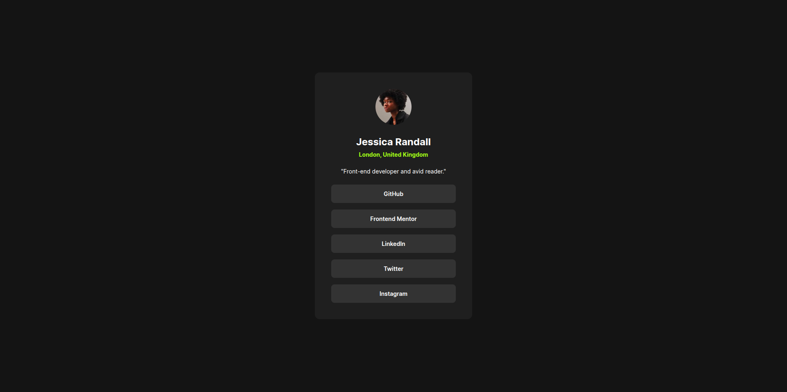

# Frontend Mentor - Social links profile solution

This is a solution to the [Social links profile challenge on Frontend Mentor](https://www.frontendmentor.io/challenges/social-links-profile-UG32l9m6dQ). Frontend Mentor challenges help you improve your coding skills by building realistic projects.

## Table of contents

- [Overview](#overview)
  - [Screenshot](#screenshot)
  - [Links](#links)
- [My process](#my-process)
  - [Built with](#built-with)
  - [Continued development](#continued-development)
  - [Useful resources](#useful-resources)
- [Author](#author)

**Note: Delete this note and update the table of contents based on what sections you keep.**

## Overview

### The challenge

Users should be able to:

- See hover and focus states for all interactive elements on the page

### Screenshot

### Links

- Solution URL: [https://github.com/juanhastier/social-links-profile](https://github.com/juanhastier/social-links-profile)
- Live Site URL: [https://juanhastier.github.io/social-links-profile](https://juanhastier.github.io/social-links-profile)

## My process

### Built with

- Semantic HTML5 markup
- CSS custom properties
- Flexbox

### Continued development

I would like to continue learning to write semantic and accessible HTML.

### Useful resources

- [MDN](https://developer.mozilla.org/en-US/) - I really enjoyed studying on MDN, and I will continue to use it in the future.
- [CSS Tricks](https://css-tricks.com/) - CSS trincks is an excellent place to learn, which I consult very often.

**Note: Delete this note and replace the list above with resources that helped you during the challenge. These could come in handy for anyone viewing your solution or for yourself when you look back on this project in the future.**

## Author

- Frontend Mentor - [@juanhastier](https://www.frontendmentor.io/profile/juanhastier)
